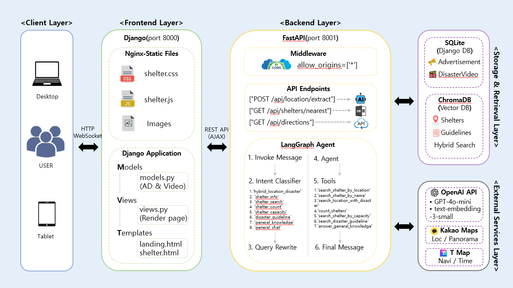
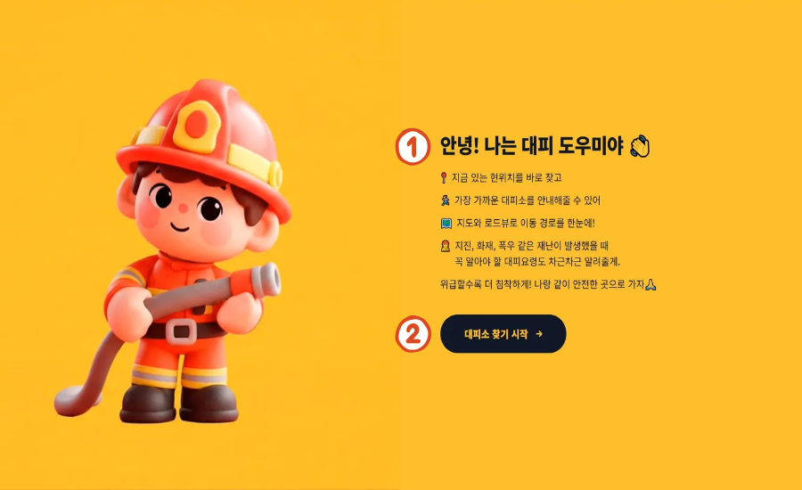
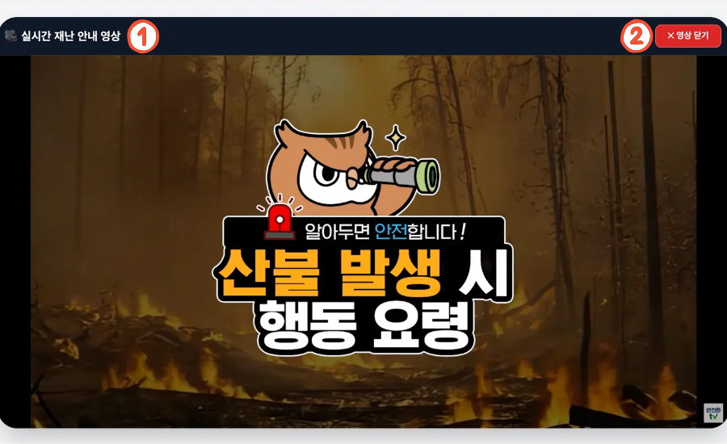
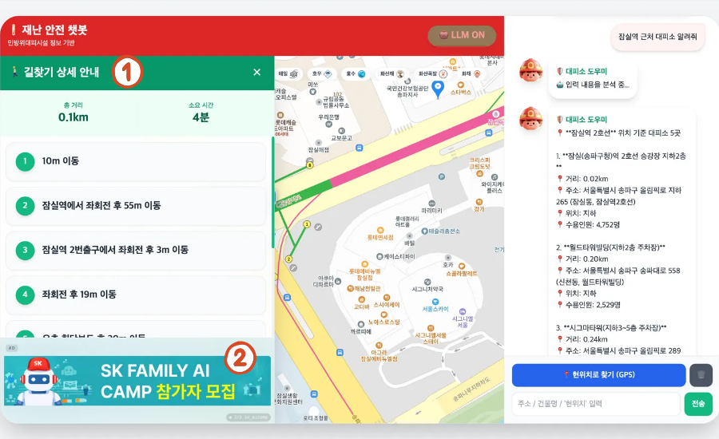
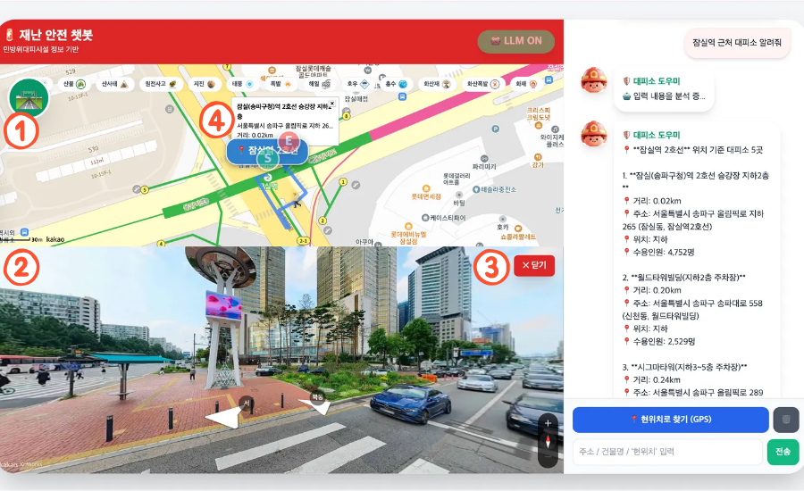

<p align="center">
  
</p>

<p align="center">
  🚨 <strong>민방위 대피시설 + 재난 행동요령 데이터 기반 Advanced RAG 시스템</strong><br>
  <sub>SK Networks Family 20기 — 4TH 5TEAM | <b>Frontend 중점 프로젝트</b></sub>
</p>

<p align="center">
  
  
  
  
  
</p>

---

## 🔄 3rd 프로젝트 대비 주요 변경 사항

> **이 프로젝트는 3rd 프로젝트를 기반으로 전면적인 아키텍처 개편 및 기능 고도화를 수행했습니다.**

| 구분 | 3rd 프로젝트 | 4th 프로젝트 (현재) |
|------|-------------|-------------------|
| **아키텍처** | 단일 FastAPI + HTML | **Backend/Frontend 분리 (MSA)** |
| **프론트엔드** | 단일 HTML 파일 | **Django 템플릿 + 정적 파일 분리** |
| **지도 API** | Naver Maps | **Kakao Maps (전면 전환)** |
| **로드뷰** | Naver Panorama | **Kakao Roadview** |
| **길찾기 API** | 없음 | **T Map 보행자 경로 API** |
| **UI/UX** | 기본 UI | **슬라이딩 패널 + 애니메이션 + 봇 아바타** |
| **의도 분류** | 8개 카테고리 | **8개 + Intent 응답 필드 추가** |
| **성능 측정** | 없음 | **LangGraph/API 처리 시간 측정** |
| **평가 시스템** | 없음 | **LLM 기반 행동요령 품질 평가** |
| **DB 연동** | 없음 | **Django ORM (광고/재난영상 관리)** |

---

## 👥 팀 구성

|  <br> 문창교 |   <br> 권규리 |   <br> 김황현 |   <br> 김효빈 |   <br> 이승규 |
|:------:|:------:|:------:|:------:|:------:|
| <a href="https://github.com/mck1902"></a> | <a href="https://github.com/gyur1eek"></a> | <a href="https://github.com/hyun2kim"></a> | <a href="https://github.com/kimobi"></a> | <a href="https://github.com/neobeauxarts"></a> |

---

## 💻 기술 스택

| 분류 | 사용 기술 |
|------|-----------|
| **언어** |  Python 3.13 |
| **프론트엔드** |  Django (템플릿 엔진)<br> HTML5<br> JavaScript (ES6+)<br> TailwindCSS |
| **백엔드** |  FastAPI (포트 8001) |
| **AI 프레임워크** |  LangChain<br> LangGraph |
| **LLM** |  GPT-4o-mini |
| **임베딩** |  OpenAI Embeddings |
| **벡터 DB** |  ChromaDB |
| **검색** |  Dense (Vector) + Sparse (BM25) Ensemble |
| **지도 API** |  Kakao Maps + Roadview ⭐ 신규<br> 좌표 변환 |
| **경로 API** |  보행자 경로 안내 ⭐ 신규 |
| **DB** |  Django ORM (광고/영상 관리) |

---

## 📌 프로젝트 개요

### 🎯 목적
사용자가 **자연어로 질문**하면, **LangGraph Agent 기반 RAG 시스템**이 민방위 대피소 정보와 재난 행동요령을 통합 검색하여 **근거 기반 답변 + 지도 시각화 + 보행자 경로 안내**를 제공하는 **실시간 재난 안전 챗봇**입니다.

### ✨ 핵심 기능 (3rd 대비 강화)

| 기능 | 3rd | 4th | 설명 |
|------|-----|-----|------|
| **의도 분류** | ✅ | ✅ | 8개 카테고리 + Intent 필드 응답 추가 |
| **하이브리드 검색** | ✅ | ✅ | Vector (60-70%) + BM25 (30-40%) 앙상블 |
| **복합 질문 처리** | ✅ | ✅ | 위치 + 재난 동시 처리 |
| **지도 시각화** | Naver | **Kakao** | 지도 API 전면 교체 |
| **경로 안내** | 카카오 자동차 | **T Map 보행자** | 걸어서 대피소까지 경로 |
| **슬라이딩 패널** | ❌ | ✅ | 길찾기 상세 안내 UI |
| **이동 애니메이션** | ❌ | ✅ | 경로 위 🚶 아이콘 이동 |
| **봇 아바타** | ❌ | ✅ | 말하는 GIF 애니메이션 |
| **성능 측정** | ❌ | ✅ | LangGraph 실행 시간 출력 |
| **LLM 평가 시스템** | ❌ | ✅ | GPT-4o 기반 응답 품질 평가 |
| **광고/영상 DB** | ❌ | ✅ | Django Admin 기반 콘텐츠 관리 |

---

## 🏗️ 시스템 아키텍처

### 전체 구조 (Backend/Frontend 분리)

<p align="center">
  
</p>

---

## 📁 프로젝트 구조

```
SKN20-4TH-5TEAM/
│
├── 📂 backend/                          # ⭐ FastAPI 백엔드 (신규 분리)
│   ├── app/
│   │   ├── main.py                      # API 서버 (포트 8001)
│   │   ├── core/
│   │   │   └── config.py                # 환경 설정
│   │   ├── models/
│   │   │   └── schemas.py               # Pydantic 모델
│   │   └── services/                    # 핵심 비즈니스 로직
│   │       ├── langgraph_agent.py       # LangGraph Agent + Tools
│   │       ├── data_loaders.py          # CSV/JSON 데이터 로드
│   │       ├── documents.py             # Document 변환
│   │       └── embedding_and_vectordb.py # 임베딩 + ChromaDB
│   ├── Dockerfile                       # 컨테이너 빌드
│   └── requirements.txt
│
├── 📂 frontend/                         # ⭐ Django 프론트엔드 (신규 분리)
│   ├── frontend/
│   │   ├── settings.py                  # Django 설정
│   │   ├── urls.py                      # URL 라우팅
│   │   └── wsgi.py                      # WSGI 설정
│   ├── main/
│   │   ├── views.py                     # 뷰 함수
│   │   ├── models.py                    # ⭐ 광고/재난영상 DB 모델
│   │   ├── admin.py                     # ⭐ Django Admin 설정
│   │   ├── urls.py                      # 앱 URL
│   │   └── management/commands/         # ⭐ CSV 임포트 커맨드
│   │       └── import_csv.py
│   ├── templates/
│   │   ├── shelter.html                 # 메인 UI 템플릿
│   │   └── landing.html                 # ⭐ 랜딩 페이지
│   ├── static/
│   │   ├── css/
│   │   │   └── shelter.css              # 분리된 스타일시트
│   │   ├── js/
│   │   │   └── shelter.js               # 분리된 JavaScript
│   │   └── images/
│   │       ├── bot2.png                 # 봇 아바타
│   │       ├── bot2_talking_v2.gif      # 말하는 봇 GIF
│   │       ├── category_icon/           # ⭐ 재난 카테고리 아이콘
│   │       └── ad_images/               # ⭐ 광고 이미지
│   └── manage.py
│
├── 📂 eval/                             # ⭐ 평가 시스템 (신규)
│   ├── eval.py                          # LLM 기반 평가 스크립트
│   ├── guideline_test.json              # 테스트 케이스 (20개)
│   └── guideline_results_llm.json       # 평가 결과
│
├── 📂 data/                             # 데이터 디렉토리
│   ├── shelter.csv                      # 민방위 대피시설 (17,292개)
│   ├── natural_disaster/                # 자연재난 행동요령 (8종)
│   │   ├── earthquake.json
│   │   ├── flood.json
│   │   ├── landslide.json
│   │   └── ...
│   └── social_disaster/                 # 사회재난 행동요령 (5종)
│       ├── fire.json
│       ├── gas.json
│       └── ...
│
├── 📂 chroma_db/                        # ChromaDB 영구 저장소
│
├── 📂 guide/                            # 가이드 문서
│   └── map_sizing_guide.md
│
├── .env                                 # 환경 변수 (API 키)
├── requirements.txt                     # 통합 의존성
└── README.md
```

---

## 🔄 데이터 흐름 및 파일별 역할

### 전체 파이프라인 구조도

```
┌─────────────────────────────────────────────────────────────────────────────────────┐
│                              📊 데이터 준비 단계 (초기화)                            │
└─────────────────────────────────────────────────────────────────────────────────────┘

    [shelter.csv]          [*.json 파일들]
          │                       │
          ▼                       ▼
┌─────────────────┐    ┌─────────────────┐
│  data_loaders.py │    │  data_loaders.py │
│  load_shelter_csv│    │  load_all_*_jsons│
└────────┬────────┘    └────────┬────────┘
         │                      │
         ▼                      ▼
    [DataFrame]            [dict 리스트]
         │                      │
         ▼                      ▼
┌─────────────────┐    ┌─────────────────┐
│   documents.py   │    │   documents.py   │
│ csv_to_documents │    │ json_to_documents│
└────────┬────────┘    └────────┬────────┘
         │                      │
         └──────────┬───────────┘
                    ▼
            [LangChain Documents]
                    │
                    ▼
┌────────────────────────────────────────┐
│        embedding_and_vectordb.py       │
│  OpenAI Embeddings + ChromaDB 저장     │
└────────────────────────────────────────┘
                    │
                    ▼
            [./chroma_db/] 💾


┌─────────────────────────────────────────────────────────────────────────────────────┐
│                              🤖 실시간 처리 단계 (서비스)                            │
└─────────────────────────────────────────────────────────────────────────────────────┘

    [사용자 질문: "강남역 근처인데 지진 났어"]
                    │
                    ▼
┌─────────────────────────────────────────────────────────────────────────────────────┐
│                       shelter.js (프론트엔드)                                       │
│                   fetch(`/api/location/extract`)                                    │
└─────────────────────────────────────────────────────────────────────────────────────┘
                    │
                    ▼
┌─────────────────────────────────────────────────────────────────────────────────────┐
│                        main.py (FastAPI 백엔드)                                     │
│                    POST /api/location/extract                                       │
│                         ↓ 시간 측정 시작                                            │
└─────────────────────────────────────────────────────────────────────────────────────┘
                    │
                    ▼
┌─────────────────────────────────────────────────────────────────────────────────────┐
│                     langgraph_agent.py (LangGraph Agent)                            │
│  ┌────────────────────────────────────────────────────────────────────────────┐    │
│  │  1️⃣ Intent Classifier Node                                                 │    │
│  │     → "hybrid_location_disaster" (위치 + 재난 복합)                         │    │
│  └────────────────────────────────────────────────────────────────────────────┘    │
│                    │                                                                │
│                    ▼                                                                │
│  ┌────────────────────────────────────────────────────────────────────────────┐    │
│  │  2️⃣ Query Rewrite Node                                                     │    │
│  │     → "강남역 지진 대피소 피난처" (BM25 최적화)                              │    │
│  └────────────────────────────────────────────────────────────────────────────┘    │
│                    │                                                                │
│                    ▼                                                                │
│  ┌────────────────────────────────────────────────────────────────────────────┐    │
│  │  3️⃣ Agent Node → Tool 선택                                                 │    │
│  │     → search_location_with_disaster() 호출                                  │    │
│  └────────────────────────────────────────────────────────────────────────────┘    │
│                    │                                                                │
│                    ▼                                                                │
│  ┌────────────────────────────────────────────────────────────────────────────┐    │
│  │  4️⃣ Tools Node                                                             │    │
│  │     ├─ Kakao Local API → 강남역 좌표 (37.4979, 127.0276)                    │    │
│  │     ├─ ChromaDB → 가까운 대피소 3곳                                         │    │
│  │     ├─ Hybrid Retriever → 지진 행동요령                                     │    │
│  │     └─ structured_data 생성 (지도 표시용)                                   │    │
│  └────────────────────────────────────────────────────────────────────────────┘    │
└─────────────────────────────────────────────────────────────────────────────────────┘
                    │
                    ▼ (응답: message + shelters + coordinates + intent)
┌─────────────────────────────────────────────────────────────────────────────────────┐
│                     main.py → LocationExtractResponse                               │
│                         ↓ 시간 측정 종료 (평균 2~5초)                               │
└─────────────────────────────────────────────────────────────────────────────────────┘
                    │
                    ▼
┌─────────────────────────────────────────────────────────────────────────────────────┐
│                         shelter.js (결과 처리)                                      │
│  ┌────────────────────────────────────────────────────────────────────────────┐    │
│  │  • addMessage() → 채팅창에 답변 표시                                        │    │
│  │  • showMapWithMultipleShelters() → 카카오 지도에 마커 표시                  │    │
│  │  • drawRoute() → T Map API로 보행자 경로 안내                               │    │
│  │  • animateMovingArrow() → 경로 위 🚶 이동 애니메이션                        │    │
│  └────────────────────────────────────────────────────────────────────────────┘    │
└─────────────────────────────────────────────────────────────────────────────────────┘
```

---

## 📝 파일별 역할 상세

### Backend 핵심 파일

| 파일 | 역할 | 3rd 대비 변경 사항 |
|------|------|------------------|
| `backend/app/main.py` | FastAPI 서버, API 엔드포인트 | **포트 8001 분리**, T Map API 추가, 시간 측정 추가, tool_used 필드 추가 |
| `backend/app/services/langgraph_agent.py` | LangGraph Agent, 7개 Tools | 키워드 기반 빠른 의도 분류, 재난 키워드 매핑 고도화 |
| `backend/app/services/data_loaders.py` | CSV/JSON 데이터 로드 | 경로 처리 개선 |
| `backend/app/services/documents.py` | Document 변환 | 동일 |
| `backend/app/services/embedding_and_vectordb.py` | 임베딩 + ChromaDB | 동일 |

### Frontend 핵심 파일

| 파일 | 역할 | 3rd 대비 변경 사항 |
|------|------|------------------|
| `frontend/templates/shelter.html` | 메인 UI 템플릿 | **Django 템플릿 전환**, Kakao Maps, 슬라이딩 패널, 영상 오버레이 |
| `frontend/templates/landing.html` | 랜딩 페이지 | **신규** (프로젝트 소개 + 진입점) |
| `frontend/static/js/shelter.js` | 지도/채팅 JavaScript | **Naver→Kakao 전환**, T Map 경로, 이동 애니메이션, 영상 모드 |
| `frontend/static/css/shelter.css` | 스타일시트 | **분리**, 애니메이션 keyframes 추가 |
| `frontend/main/views.py` | Django 뷰 | **신규** (템플릿 렌더링 + API 키 전달 + DB 데이터) |
| `frontend/main/models.py` | DB 모델 | **신규** (Advertisement, DisasterVideo) |
| `frontend/main/admin.py` | Django Admin | **신규** (광고/영상 관리 인터페이스) |

### 평가 시스템 파일 (신규)

| 파일 | 역할 | 설명 |
|------|------|------|
| `eval/eval.py` | LLM 평가 스크립트 | GPT-4o 기반 응답 품질 평가 |
| `eval/guideline_test.json` | 테스트 케이스 | 20개 재난 시나리오 |
| `eval/guideline_results_llm.json` | 평가 결과 | 상세 점수 및 피드백 |

---

## 🚀 설치 & 실행

### 1️⃣ 환경 변수 설정 (.env)

```bash
OPENAI_API_KEY=your_openai_api_key
KAKAO_REST_API_KEY=your_kakao_rest_api_key
KAKAO_JS_API_KEY=your_kakao_js_api_key
TMAP_API_KEY=your_tmap_api_key
DJANGO_SECRET_KEY=your_django_secret_key
```

### 2️⃣ 패키지 설치

```bash
# 통합 설치 (루트 디렉토리에서)
pip install -r requirements.txt

# 또는 개별 설치
# 백엔드
pip install -r backend/requirements.txt

# 프론트엔드
pip install -r frontend/requirements.txt
```

### 3️⃣ VectorDB (ChromaDB)

> ✅ **이미 존재하는 `chroma_db/` 폴더 사용**

```
SKN20-4TH-5TEAM/
└── chroma_db/                    ← 이미 임베딩 완료된 DB 포함
    ├── chroma.sqlite3
    └── c41f94b5-.../
```

| 항목 | 내용 |
|------|------|
| **대피소 데이터** | 17,292개 민방위 대피시설 |
| **재난 행동요령** | 자연재난 8종 + 사회재난 5종 |
| **임베딩 모델** | OpenAI `text-embedding-3-small` |
| **검색 방식** | Hybrid (Vector 60-70% + BM25 30-40%) |

### 4️⃣ Django 초기화 (최초 1회)

```bash
cd frontend

# DB 마이그레이션
python manage.py migrate

# 관리자 계정 생성
python manage.py createsuperuser

# 광고/영상 데이터 임포트 (선택)
python manage.py import_csv --ads ../data/ads.csv --videos ../data/videos.csv
```

### 5️⃣ 서버 실행

```bash
# 터미널 1: Backend (FastAPI)
cd backend
uvicorn app.main:app --host 0.0.0.0 --port 8001 --reload

# 터미널 2: Frontend (Django)
cd frontend
python manage.py runserver 0.0.0.0:8000
```

### 6️⃣ 접속

- **랜딩 페이지**: http://localhost:8000
- **챗봇 메인**: http://localhost:8000/map/
- **Django Admin**: http://localhost:8000/admin/
- **Backend API Docs**: http://localhost:8001/docs

---

## 🔧 API 엔드포인트

### `POST /api/location/extract` ⭐ 메인 API

**Request:**
```json
{
  "query": "강남역 근처인데 지진 났어"
}
```

**Response:**
```json
{
  "success": true,
  "location": "강남역",
  "coordinates": [37.4979, 127.0276],
  "shelters": [
    {
      "name": "강남역지하상가",
      "address": "서울 강남구 강남대로 지하396",
      "lat": 37.4979,
      "lon": 127.0276,
      "distance": 0.12,
      "capacity": 5000
    }
  ],
  "total_count": 3,
  "message": "🚨 강남역 근처 지진 발생 시 대응 가이드\n\n📍 가장 가까운 대피소 3곳\n...",
  "intent": "hybrid_location_disaster",
  "tool_used": "search_location_with_disaster"
}
```

### `GET /api/shelters/nearest`

GPS 좌표 기반 가장 가까운 대피소 검색

### `GET /api/directions` ⭐ T Map 보행자 경로

**Query Parameters:**
- `origin`: 출발지 좌표 (lon,lat)
- `destination`: 도착지 좌표 (lon,lat)

**Response:** GeoJSON 형식의 보행자 경로

---

## 🎨 UI/UX 화면 설계

### 1️⃣ 랜딩 페이지

<p align="center">
  
</p>

| 번호 | 구성 요소 | 설명 |
|:----:|----------|------|
| ① | **챗봇 설명** | 서비스 소개 및 주요 기능 안내 텍스트 |
| ② | **챗봇 페이지 버튼** | 메인 챗봇 화면으로 이동하는 CTA 버튼 |

---

### 2️⃣ 메인 챗봇 페이지

<p align="center">
  
</p>

| 번호 | 구성 요소 | 설명 |
|:----:|----------|------|
| ① | **프롬프트 작성 입력창** | 사용자가 자연어로 질문을 입력하는 텍스트 필드 |
| ② | **현위치 기반 대피소 찾기 버튼** | GPS를 활용하여 현재 위치 주변 대피소 자동 검색 |
| ③ | **대화 클리어 버튼** | 채팅 히스토리 초기화 (🗑️ 아이콘) |
| ④ | **서비스 소개영상 페이지 연결** | 재난별 행동요령 영상 카테고리 버튼 (지도 상단) |

**추가 UI 요소:**

| 기능 | 설명 | 구현 |
|------|------|------|
| **반응형 2분할 레이아웃** | 지도(7) : 채팅(3) 비율의 Flexbox 구조 | `shelter.html` |
| **헤더 영역** | 타이틀 + 사이렌 아이콘 + LLM 상태 배지 | `shelter.html` |
| **봇 아바타** | 정지 이미지 → 응답 시 GIF 애니메이션 | `bot2.png`, `bot2_talking_v2.gif` |
| **자동 스크롤** | 새 메시지 시 최하단으로 스크롤 | `chatWindow.scrollTop` |

---

### 3️⃣ 재난 영상 모드

<p align="center">
  
</p>

| 번호 | 구성 요소 | 설명 |
|:----:|----------|------|
| ① | **행동 요령 관련 영상** | YouTube 임베드 전체화면 재생 (재난 카테고리별) |
| ② | **영상 닫기** | ✕ 버튼으로 영상 오버레이 종료 |

**지원 재난 카테고리:** 지진, 홍수, 산사태, 호우, 해일, 태풍, 화산재, 화산폭발, 댐붕괴, 화재, 폭발, 원전사고, 산불 (13종)

| 기능 | 설명 | 구현 |
|------|------|------|
| **카테고리 버튼** | DB에서 로드된 재난 종류별 아이콘 버튼 | `` |
| **영상 오버레이** | 전체 화면을 덮는 어두운 배경 + 중앙 영상 | `video-overlay` |
| **자동 재생** | 오버레이 열릴 때 자동 재생 시작 | `autoplay=1` 파라미터 |

---

### 4️⃣ 길찾기 슬라이딩 패널

<p align="center">
  
</p>

| 번호 | 구성 요소 | 설명 |
|:----:|----------|------|
| ① | **길찾기 슬라이드바** | 좌측에서 슬라이드되어 나오는 경로 안내 패널 |
| ② | **광고 배너** | DB 기반 5초 간격 자동 로테이션 광고 영역 |

**슬라이딩 패널 상세 기능:**

| 기능 | 설명 | 구현 |
|------|------|------|
| **토글 버튼** | 🛣️ 버튼으로 패널 열기/닫기 | `toggleNavDrawer()` |
| **슬라이드 애니메이션** | `translate-x` 기반 좌측 슬라이드 | `transition-transform` |
| **요약 정보** | 총 거리(km), 소요 시간(분) 표시 | `nav-summary` |
| **단계별 안내** | 번호 + 방향 설명 + 이동 거리 | `nav-list` |
| **광고 로테이션** | Django DB 연동, 5초 간격 자동 전환 | `initAdRotation()` |
| **커스텀 스크롤바** | 초록색 테마 스크롤바 | `.custom-scrollbar` |

---

### 5️⃣ 로드뷰 & 경로 안내

<p align="center">
  
</p>

| 번호 | 구성 요소 | 설명 |
|:----:|----------|------|
| ① | **길찾기 ON/OFF 버튼** | T Map 보행자 경로 표시 토글 |
| ② | **하단 로드뷰** | 지도 클릭 위치의 Kakao Roadview 실시간 표시 |
| ③ | **로드뷰 닫기 버튼** | ✕ 버튼으로 로드뷰 영역 숨김 |

**경로 안내 상세 기능:**

| 기능 | 설명 | 구현 |
|------|------|------|
| **T Map 보행자 경로** | 걸어서 대피소까지 최적 경로 계산 | `drawRoute()` |
| **경로 폴리라인** | 파란색 실선으로 경로 시각화 | `kakao.maps.Polyline` |
| **출발/도착 마커** | S(초록), E(빨강) 원형 오버레이 | `CustomOverlay` |
| **이동 애니메이션** | 🚶 아이콘이 경로 따라 이동 | `animateMovingArrow()` |
| **방향 자동 반전** | 진행 방향에 따라 좌우 반전 | `scaleX(-1)` / `scaleX(1)` |

**지도 & 마커 기능:**

| 기능 | 설명 | 구현 |
|------|------|------|
| **현위치 마커** | GPS 기반 파란색 "📍 현재 위치" 오버레이 | `createUserMarker()` |
| **검색 위치 마커** | 검색한 장소에 파란색 위치명 오버레이 | `showMapWithMultipleShelters()` |
| **대피소 마커** | 검색 결과 대피소들에 기본 마커 표시 | `showMapWithMultipleShelters()` |
| **정보창 (InfoWindow)** | 마커 클릭 시 대피소 상세 정보 팝업 | `kakao.maps.InfoWindow` |
| **지도 범위 자동 조정** | 모든 마커가 보이도록 `setBounds()` | `showMapWithMultipleShelters()` |

---

### ✨ 애니메이션 효과

| 애니메이션 | 설명 | CSS Keyframes |
|------------|------|---------------|
| **사이렌 경광등** | 🚨 아이콘 3D 회전 + 빛 번쩍 효과 | `@keyframes real-siren` |
| **걷는 아이콘** | 🚶 아이콘 좌우 흔들림 (경로 이동 시) | `@keyframes walking` |
| **봇 말하기** | 아바타 확대/축소 + 살짝 기울임 | `@keyframes bot-talking` |
| **LLM 배지 펄스** | ON 상태 시 깜빡임 효과 | `animate-pulse` (Tailwind) |
| **손 흔들기** | 랜딩 페이지 👋 아이콘 | `@keyframes wave-animation` |

---

### 🎛️ 상태 표시 & 컨트롤

| 기능 | 설명 | 구현 |
|------|------|------|
| **LLM 상태 배지** | ON(초록) / 규칙기반(주황) / OFF(회색) | `updateLlmBadge()` |
| **버튼 비활성화** | 로딩 중 반투명 + `cursor: not-allowed` | `.disabled-control` |
| **로드뷰 닫기 버튼** | ✕ 버튼으로 로드뷰 숨김 | `hidePanorama()` |

---

## ⚙️ LangGraph Agent 구조

```
[사용자 쿼리]
      │
      ▼
┌─────────────────────────────────────────────────────────────────┐
│  Intent Classifier Node                                         │
│  └─ 8개 카테고리 분류 (키워드 우선 매칭 → LLM 폴백)              │
│     ├─ hybrid_location_disaster (위치 + 재난)                   │
│     ├─ shelter_info (시설명 검색)                               │
│     ├─ shelter_search (위치 기반 검색)                          │
│     ├─ shelter_count (개수 통계)                                │
│     ├─ shelter_capacity (수용인원 기준)                         │
│     ├─ disaster_guideline (행동요령)                            │
│     ├─ general_knowledge (일반 지식)                            │
│     └─ general_chat (일상 대화)                                 │
└─────────────────────────────────────────────────────────────────┘
      │
      ▼
┌─────────────────────────────────────────────────────────────────┐
│  Query Rewrite Node                                              │
│  └─ BM25 최적화: 조사 제거, 핵심 키워드 추출, 동의어 추가         │
│  └─ 카카오/Vector 용도별 쿼리 분리 (location_type 판단)          │
└─────────────────────────────────────────────────────────────────┘
      │
      ▼
┌─────────────────────────────────────────────────────────────────┐
│  Agent Node → 7개 Tools 선택                                    │
│  ├─ search_shelter_by_location (Kakao API + Haversine)          │
│  ├─ search_shelter_by_name (시설명 검색)                        │
│  ├─ search_location_with_disaster (복합 검색)                   │
│  ├─ count_shelters (통계)                                       │
│  ├─ search_shelter_by_capacity (수용인원 필터)                  │
│  ├─ search_disaster_guideline (하이브리드 검색)                 │
│  └─ answer_general_knowledge (LLM 직접 응답)                    │
└─────────────────────────────────────────────────────────────────┘
      │
      ▼
[structured_data + message 응답]
```

### 재난 키워드 매핑

```python
disaster_keyword_mapping = {
    # 기상 재난 - 비/물 관련
    "비", "폭우", "집중호우" → "호우",
    "홍수", "침수", "범람" → "홍수",
    "태풍", "강풍", "돌풍" → "태풍",
    
    # 지질 재난
    "지진", "진동", "여진" → "지진",
    "쓰나미", "해일" → "지진해일",
    "산사태", "토석류", "낙석" → "산사태",
    
    # 화재/폭발
    "화재", "불", "연기" → "화재",
    "산불", "산림 화재" → "산불",
    "폭발", "가스 폭발" → "폭발",
    "가스", "가스 누출" → "가스",
    
    # 기타
    "화산", "분화" → "화산폭발",
    "방사능", "핵", "원전" → "방사능",
    "댐 붕괴" → "댐붕괴"
}
```

---

## 📊 성능 평가 시스템

### 🎯 평가 개요

LLM(GPT-4o)을 평가자로 사용하여 재난 행동요령 응답의 품질을 체계적으로 측정합니다.

```
┌─────────────────────────────────────────────────────────────────┐
│                    LLM 평가 파이프라인                          │
├─────────────────────────────────────────────────────────────────┤
│  테스트 케이스 (20개)                                           │
│       │                                                         │
│       ▼                                                         │
│  LangGraph Agent 실행                                           │
│       │                                                         │
│       ▼                                                         │
│  GPT-4o 평가자                                                  │
│  ├─ 관련성 (60점): 핵심 행동요령 포함 여부                      │
│  ├─ 품질 (20점): 구체성 및 실용성                               │
│  └─ 순수도 (20점): 다른 재난 정보 오염 여부                     │
│       │                                                         │
│       ▼                                                         │
│  구조화된 평가 결과 (JSON)                                      │
└─────────────────────────────────────────────────────────────────┘
```

### 📈 평가 결과 요약

| 지표 | 점수 | 비고 |
|------|------|------|
| **평균 총점** | **75.1 / 100** | 양호 수준 |
| **관련성 점수** | 42.25 / 60 (70.4%) | 핵심 행동요령 포함률 |
| **품질 점수** | 15.55 / 20 (77.8%) | 구체적이고 실용적 |
| **순수도 점수** | 17.30 / 20 (86.5%) | 오염 최소화 |

### 📊 등급별 분포

```
🏆 우수 (90-100점): ████████████████████████████████████  7개 (35.0%)
✅ 양호 (70-89점):  ████████████████████████████████████  7개 (35.0%)
⚠️  보통 (50-69점):  ███████████████                       3개 (15.0%)
❌ 미흡 (0-49점):   ███████████████                       3개 (15.0%)
```

### 🔍 테스트 케이스 분류

| 카테고리 | 개수 | 설명 | 평균 점수 |
|----------|------|------|-----------|
| **basic** | 8개 | 기본 재난 행동요령 질문 | 79.1점 |
| **casual** | 4개 | 일상적/긴급 상황 표현 | 78.5점 |
| **action** | 4개 | 구체적 행동 요청 | 82.3점 |
| **cause** | 2개 | 재난 원인 설명 요청 | 45.5점 |
| **location_combined** | 2개 | 위치 + 재난 복합 질문 | 76.5점 |

### ✨ 우수 사례 (90점 이상)

| 질문 | 점수 | 주요 강점 |
|------|------|----------|
| "화재 나면?" | 93점 | 구체적 대피 지침, 소화기 사용법 포함 |
| "지진 발생 시 안전한 자세는?" | 93점 | Drop-Cover-Hold 명확히 설명 |
| "쓰나미 났을 때" | 91점 | 핵심 대피 요령 + 추가 주의사항 |
| "불이야!" | 91점 | 긴급 상황에 적절한 즉각 대응 안내 |
| "산불 대피" | 91점 | 바람 방향 고려, 연기 피하기 등 |
| "화재에서 대피하려면 어디로 가야 해?" | 91점 | 실용적 대피 경로 안내 |
| "건물이 흔들리고 있어. 무서워" | 91점 | 감정적 지지 + 정확한 행동 지침 |

### ⚠️ 개선 필요 사례

| 질문 | 점수 | 개선 방향 |
|------|------|----------|
| "산사태 대피" | 48점 | 위치 정보 요청 대신 즉각적인 행동요령 제공 필요 |
| "지진 발생 원인은?" | 43점 | 원인 설명 + 관련 행동요령 함께 제공 |
| "화산이 터졌다니까?" | 38점 | 정의 설명보다 대피 행동요령 우선 제공 |

### 📝 주요 피드백 반영

1. **가스/전기 차단 언급 보강**: 지진 행동요령에서 누락되는 경우 다수
2. **"불이야!" 외치기 추가**: 화재 시 주변 알림 행동 강조 필요
3. **원인 질문 대응 개선**: 원인 설명과 함께 관련 행동요령도 제공

---

## 📊 API 성능 측정 결과

### ⏱️ 응답 시간 분석

```
[API 요청 시작] '강남역 근처인데 지진 났어'
============================================================
⏱️ [성능 측정 결과]
  - 의도분류 시간: 0.312초
  - 질문재정의 시간: 0.287초
  - LLM 호출 시간: 0.856초
  - 도구 실행 시간: 1.234초
    ├─ 카카오 API 호출: 0.189초
    └─ ChromaDB 검색: 0.156초
  - LangGraph 총 시간: 2.689초
  - API 총 처리 시간: 2.891초
============================================================
```

### 📈 평균 처리 시간

| 단계 | 평균 시간 | 비고 |
|------|----------|------|
| **의도 분류** | 0.3초 | GPT-4o-mini |
| **질문 재정의** | 0.3초 | 카카오/Vector 용도 분리 |
| **도구 실행** | 1.0~2.0초 | 외부 API + DB 검색 |
| **LangGraph 총합** | 2.0~5.0초 | 질문 복잡도에 따라 변동 |
| **API 총 응답** | 2.5~5.5초 | 네트워크 상태 영향 |

### 🔧 최적화 적용 사항

1. **키워드 기반 빠른 의도 분류**: LLM 호출 전 정규식 매칭으로 명확한 케이스 즉시 분류
2. **structured_data 즉시 종료**: 도구 결과에 구조화 데이터 있으면 추가 LLM 호출 생략
3. **병렬 처리 고려**: 카카오 API와 ChromaDB 검색 동시 실행 가능

---

## 🗄️ Django 데이터베이스 모델

### Advertisement (광고)

```python
class Advertisement(models.Model):
    ad_kind = models.CharField(max_length=100)      # 광고 종류
    ad_id = models.CharField(max_length=50)         # UUID 기반 자동 생성
    image_path = models.CharField(max_length=500)   # 이미지 경로
    title = models.CharField(max_length=200)        # 광고 제목
    is_active = models.BooleanField(default=True)   # 활성화 여부
    display_order = models.IntegerField(default=0)  # 표시 순서
```

### DisasterVideo (재난 영상)

```python
class DisasterVideo(models.Model):
    DISASTER_KIND_CHOICES = [
        ('지진', '지진'), ('홍수', '홍수'), ('산사태', '산사태'),
        ('호우', '호우'), ('해일', '해일'), ('태풍', '태풍'),
        ('화산재', '화산재'), ('화산폭발', '화산폭발'), ('댐붕괴', '댐붕괴'),
        ('화재', '화재'), ('폭발', '폭발'), ('원전사고', '원전사고'),
        ('산불', '산불'),
    ]
    
    disaster_kind = models.CharField(choices=DISASTER_KIND_CHOICES)
    youtube_link = models.URLField()                # YouTube 임베드 링크
    icon_path = models.CharField(max_length=500)    # 카테고리 아이콘 경로
    is_active = models.BooleanField(default=True)   # 활성화 여부
```

### Django Admin 기능

- **광고 관리**: 이미지 미리보기, 활성화/비활성화, 표시 순서 조정
- **재난 영상 관리**: 카테고리별 필터링, 일괄 활성화/비활성화
- **CSV 일괄 임포트**: `python manage.py import_csv` 커맨드

---

## 🌱 향후 개선 계획

- [ ] Docker Compose로 원클릭 배포
- [ ] 실시간 재난 알림 Push 연동
- [ ] 카테고리별 대피소 필터링 (장애인, 유아, 반려동물)
- [ ] 다국어 지원 (영어, 중국어, 일본어)
- [x] ~~RAG 평가 지표 적용~~ (LLM 평가자 기반 구현 완료)
- [ ] 음성 입력/출력 지원
- [ ] 평가 점수 80점 이상 달성 (현재 75.1점)

---

## 📝 라이선스

이 프로젝트는 SK Networks Family 20기 AI 교육 과정의 일환으로 제작되었습니다.

---

<p align="center">
  
</p>