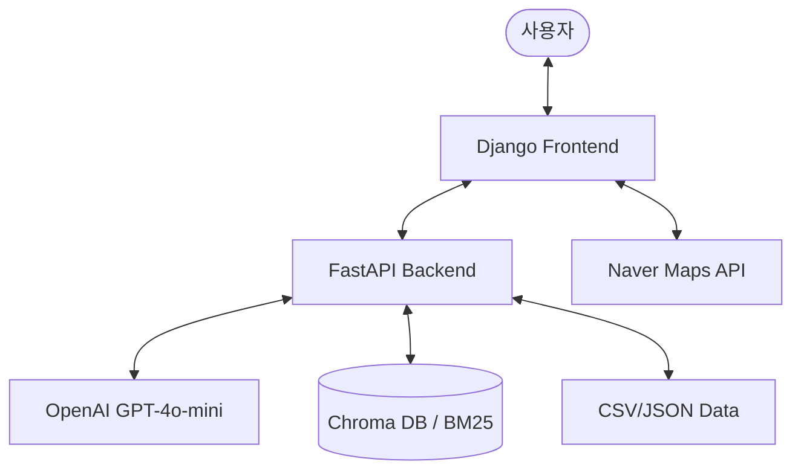

# 재난 대피소 안내 챗봇 프로젝트 전체 소스 분석

이 프로젝트는 **FastAPI 백엔드**와 **Django 프론트엔드**가 통합된 **RAG(Retrieval-Augmented Generation) 기반 재난 대피 시스템**입니다. 사용자의 질문을 AI가 분석하여 가장 적합한 대피소 정보를 지도와 함께 제공하며, 재난 시 행동 요령도 안내합니다.

## 🏗️ 전체 아키텍처

---

## 🔹 1. 백엔드 분석 (FastAPI)

백엔드는 `backend` 디렉토리에 위치하며, 실질적인 AI 로직과 데이터 검색을 담당합니다.

### 🔑 주요 핵심: LangGraph Agent (`langgraph_agent.py`)
이 프로젝트의 "두뇌" 역할을 합니다. 단순한 텍스트 답변을 넘어, 사용자의 의도를 분석하고 적절한 도구(Tool)를 실행합니다.

- **의도 분류(Intent Classification)**: 질문을 `hybrid_location_disaster`, `shelter_info`, `shelter_search` 등 8가지 카테고리로 분류합니다.
- **하이브리드 검색(Hybrid RAG)**: 
  - **Dense Retrieval**: `OpenAI Embeddings`와 `Chroma`를 사용해 의미론적 유사도 검색.
  - **Sparse Retrieval**: `BM25`를 사용해 정확한 키워드 매칭.
  - 이 두 결과를 가중치 기반으로 결합하여 최적의 정보를 추출합니다.
- **다양한 도구(Tools)**:
  - `search_shelter_by_location`: 카카오 로컬 API와 연동하여 특정 위치 주변 대피소 검색.
  - `count_shelters`: 특정 지역의 대피소 개수 통계 제공.
  - `search_shelter_by_capacity`: 수용 인원 기준 필터링.
  - `search_disaster_guideline`: 재난 행동 요령 검색.

### 🔌 API 엔드포인트 (`main.py`)
- `POST /api/location/extract`: 사용자의 자연어 입력에서 위치 및 의도를 추출하여 구조화된 데이터와 답변 반환.
- `GET /api/shelters/nearest`: GPS 좌표 기반 실시간 가장 가까운 대피소 조회.
- `POST /api/chatbot`: 일반적인 재난 관련 질의응답 처리.

---

## 🔹 2. 프론트엔드 분석 (Django)

프론트엔드는 `frontend` 디렉토리에 위치하며, 사용자 인터페이스(UI)를 제공합니다.

### 🎨 화면 구성 (`shelter.html`)
- **Tailwind CSS**를 활용한 세련되고 현대적인 반응형 디자인.
- **네이버 지도(Naver Maps)** 연동: 대피소 위치 마커 표시 및 거리 측정.
- **파노라마(Street View)** 모드: 지도를 클릭하면 해당 위치의 실제 거리 뷰 표시.

### ⚡ 사용자 경험 (`shelter.js`)
- **실시간 위치(GPS)** 연동: 사용자의 현재 위치를 즉시 파악하여 주변 대피소 자동 조회.
- **인터랙티브 채팅**: 사용자가 "강남역 근처 대피소"라고 입력하면 백엔드와 통신하여 결과를 지도 위에 마커로 표시.
- **상태 처리**: 백엔드 연결 상태 및 LLM 활성화 여부를 실시간으로 체크하여 사용자에게 알림.

---

## 🔹 3. 데이터 및 설정

- **데이터 소스 (`data/`)**: 
  - `shelter.csv`: 전국 민방위 대피시설 정보 (위치, 수용인원 등 약 4.7MB).
  - `natural_disaster/`, `social_disaster/`: 재난 종류별 행동 요령 JSON 데이터.
- **환경 변수 (`.env`)**: 
  - `OPENAI_API_KEY`: AI 엔진용.
  - `NAVER_MAP_CLIENT_ID`: 지도 API용.
  - `KAKAO_REST_API_KEY`: 위치 검색(Geocoding)용.

---

## 💡 종합 요평

이 프로젝트는 **최신 AI 기술(LangChain, LangGraph, RAG)**과 **현실적인 공공 데이터**를 결합하여 실생활에 유용한 안전 서비스를 구축한 훌륭한 사례입니다. 

1. **정교한 검색**: 하이브리드 리트리버를 통해 오타나 줄임말에도 강한 검색 성능을 보여줍니다.
2. **구조화된 인터페이스**: 챗봇의 텍스트 응답뿐만 아니라, 지도의 좌표 데이터를 연동하여 시각적인 정보를 효과적으로 전달합니다.
3. **확장성**: LangGraph를 사용하고 있어 새로운 재난 데이터나 기능을 도구(Tool) 형태로 쉽게 추가할 수 있는 구조입니다.
